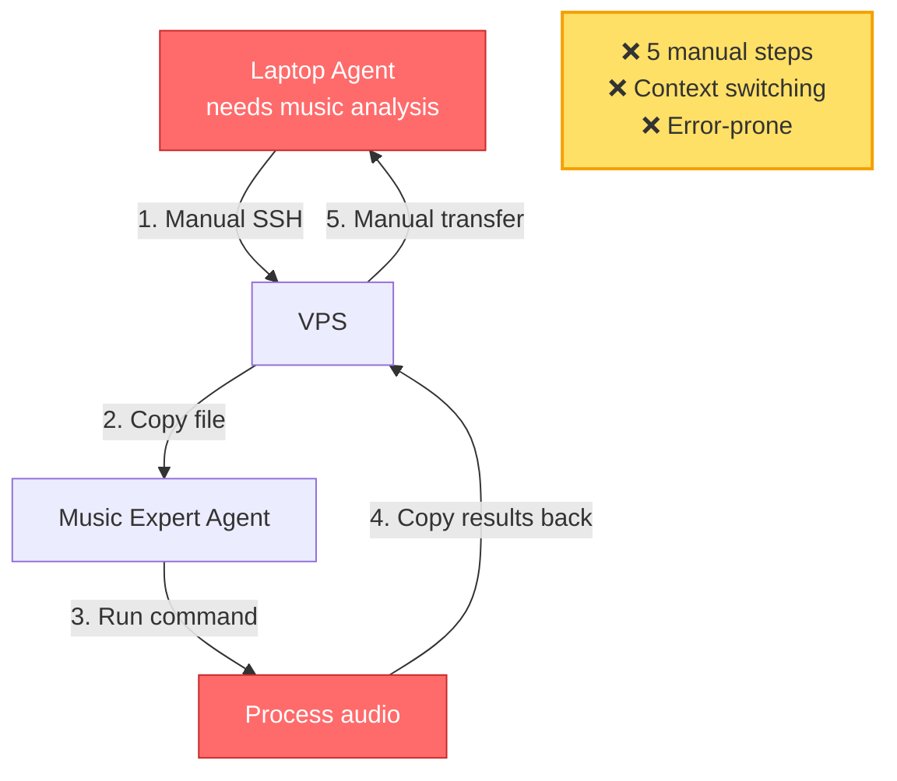
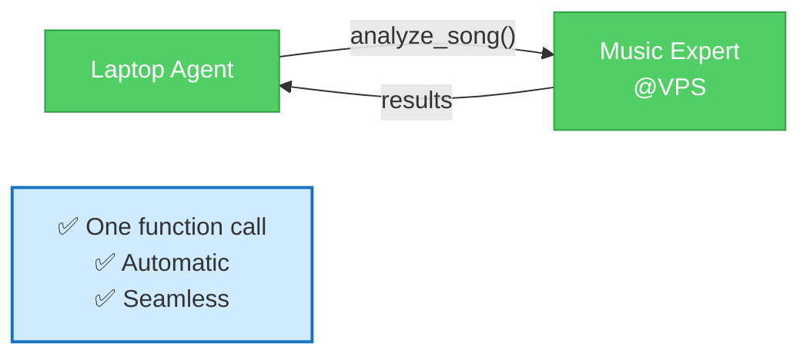
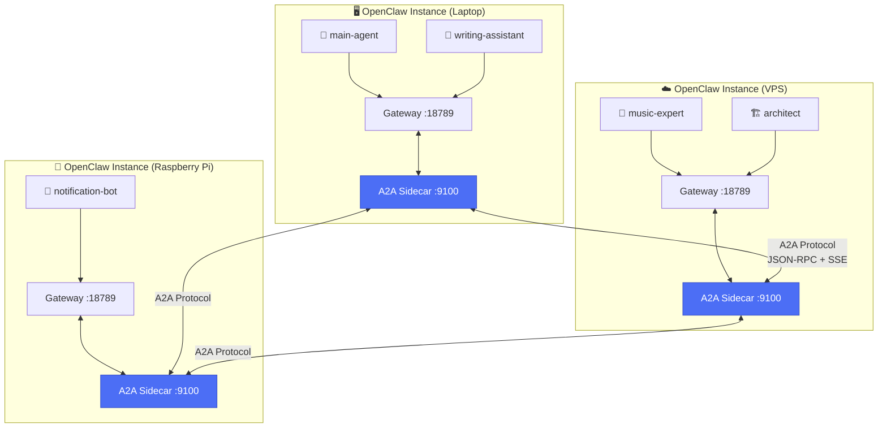
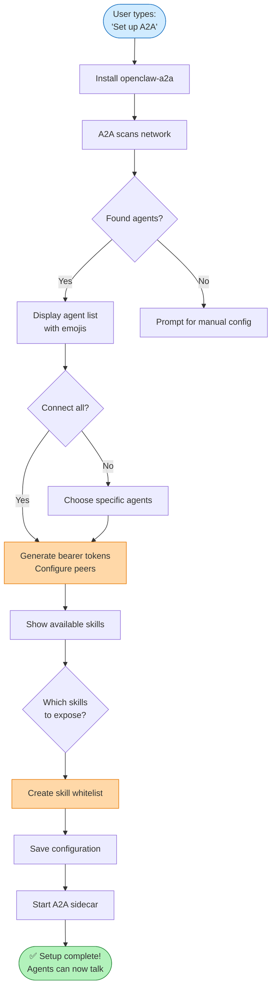
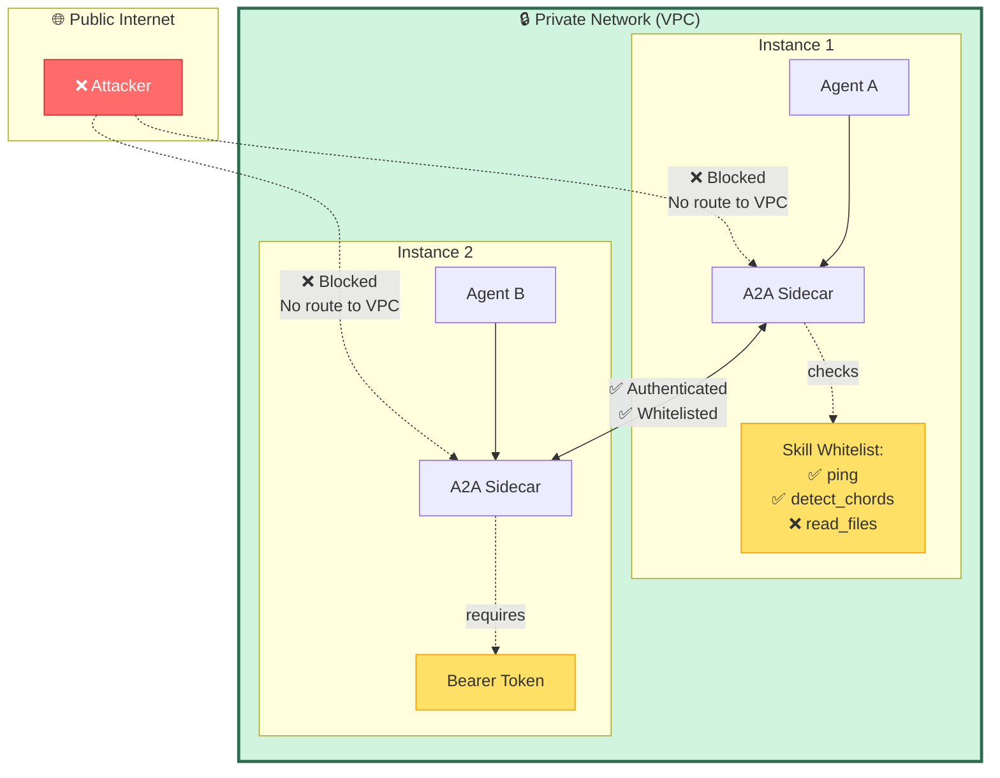
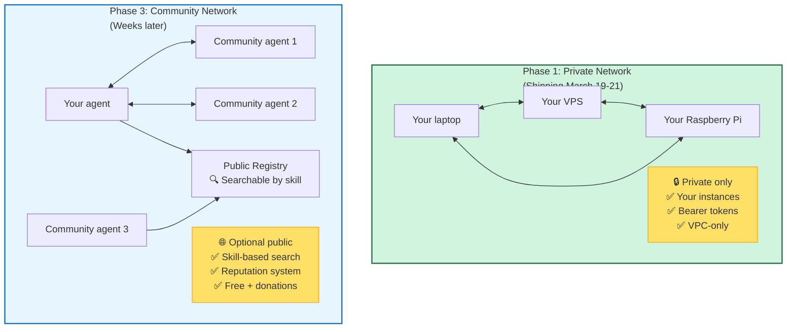
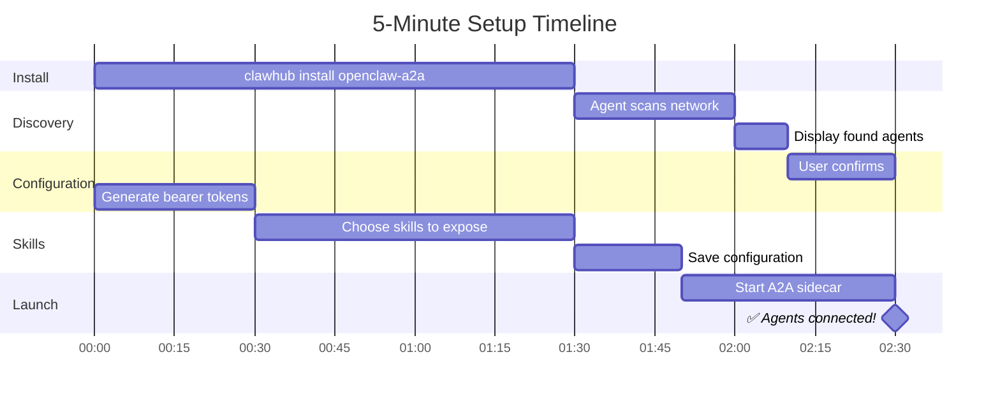

# Mermaid Diagrams for openclaw-a2a

These diagrams can be embedded directly in the README using Mermaid syntax.

---

## 1. Before/After Comparison

### Before: Manual Coordination


### After: A2A Communication


---

## 2. Architecture Diagram



---

## 3. User Flow (Setup)



---

## 4. Skill Execution Flow

```mermaid
sequenceDiagram
    participant User
    participant WritingAgent as 📝 Writing Agent<br/>(Laptop)
    participant A2AClient as A2A Client
    participant A2AServer as A2A Server
    participant MusicAgent as 🎼 Music Expert<br/>(VPS)
    
    User->>WritingAgent: "Analyze chords in Hotel California"
    WritingAgent->>A2AClient: call_skill("music-expert@vps",<br/>"detect_chords", {song: "..."})
    
    A2AClient->>A2AClient: Find peer config<br/>(IP + token)
    A2AClient->>A2AServer: POST /a2a/jsonrpc<br/>+ Bearer token
    A2AServer->>A2AServer: Validate token<br/>Check skill whitelist
    
    alt Skill allowed
        A2AServer->>MusicAgent: Execute skill via Gateway
        MusicAgent->>MusicAgent: Process audio<br/>Detect chords
        MusicAgent->>A2AServer: Return: "Am, E7, G, D..."
        A2AServer->>A2AClient: SSE stream result
        A2AClient->>WritingAgent: Chord data
        WritingAgent->>User: "The song uses Am-E7-G-D..."
    else Skill blocked
        A2AServer->>A2AClient: 403 Forbidden<br/>(not whitelisted)
        A2AClient->>WritingAgent: Error: skill not exposed
        WritingAgent->>User: "Music agent doesn't expose that skill"
    end
    
    style WritingAgent fill:#51cf66,stroke:#2f9e44
    style MusicAgent fill:#51cf66,stroke:#2f9e44
    style A2AServer fill:#4c6ef5,stroke:#364fc7
```

---

## 5. Security Model (Visual)



---

## 6. Multi-Agent Collaboration Example

```mermaid
graph TB
    User[👤 User: "Write an article<br/>about Hotel California"]
    
    User --> WA[📝 Writing Assistant<br/>Laptop]
    
    WA -->|"I need chord analysis"| ME[🎼 Music Expert<br/>VPS]
    WA -->|"I need historical context"| RE[🔍 Research Agent<br/>Pi]
    
    ME -->|"Am-E7-G-D progression<br/>+ music theory explanation"| WA
    RE -->|"Released 1976<br/>Eagles' best-selling single"| WA
    
    WA -->|Synthesizes:<br/>✅ Chord analysis<br/>✅ Historical context<br/>✅ Cohesive narrative| Draft[📄 Article Draft]
    
    Draft --> User
    
    style User fill:#e7f5ff,stroke:#1971c2
    style WA fill:#51cf66,stroke:#2f9e44,color:#fff
    style ME fill:#ffd8a8,stroke:#e67700
    style RE fill:#ffd8a8,stroke:#e67700
    style Draft fill:#b2f2bb,stroke:#2b8a3e
```

---

## 7. Phase 1 vs Phase 3 Comparison



---

## 8. "5 Minutes to Working Agents" Visual Timeline



---

## Usage Instructions for README

Add these diagrams to the README at strategic points:

1. **Before/After Comparison** → Right after "What You Can Do" section
2. **Architecture Diagram** → In "Technical Overview" section
3. **User Flow (Setup)** → In "How Easy Is It?" section
4. **Skill Execution Flow** → In "Real-World Examples" section
5. **Security Model** → In "Security (Simple & Clear)" section
6. **Multi-Agent Collaboration** → In "Real-World Examples" section
7. **Phase Comparison** → In "Roadmap & Timeline" section
8. **5-Minute Timeline** → In "How Easy Is It?" section

GitHub automatically renders Mermaid diagrams in markdown files.
