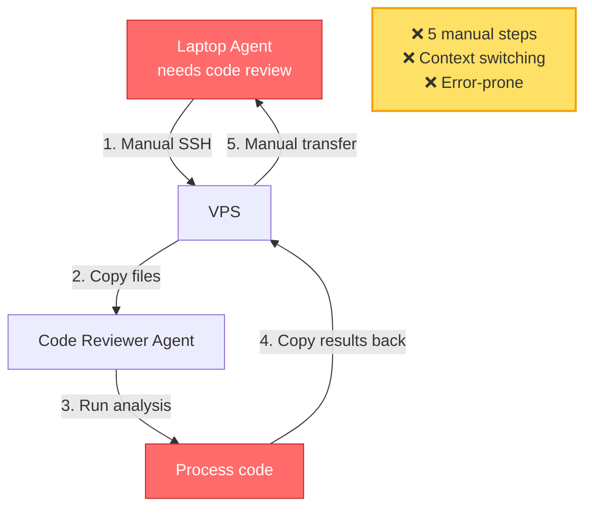
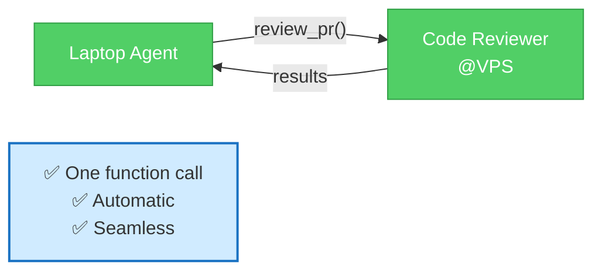
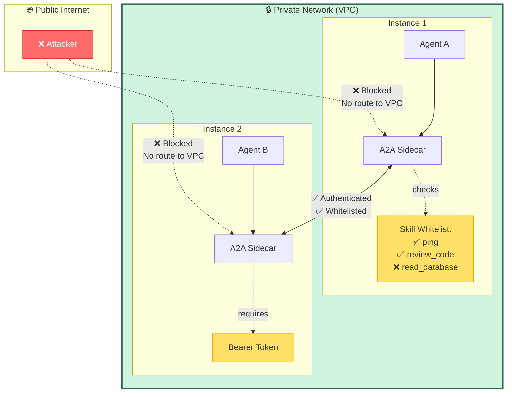
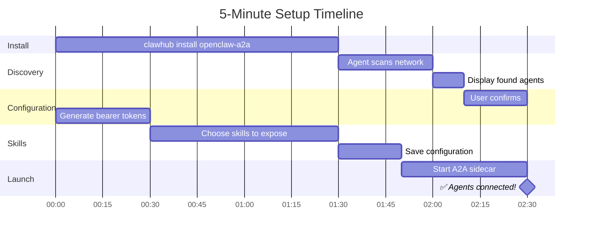
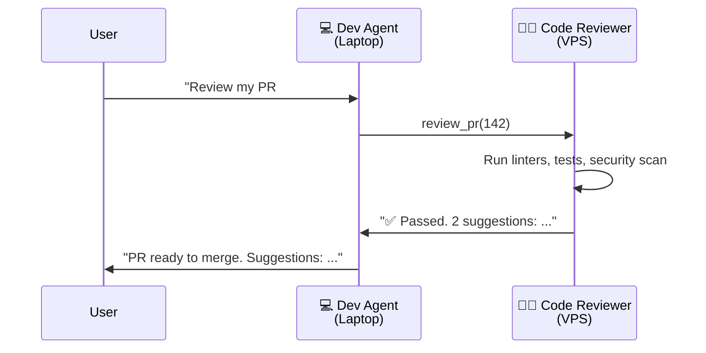
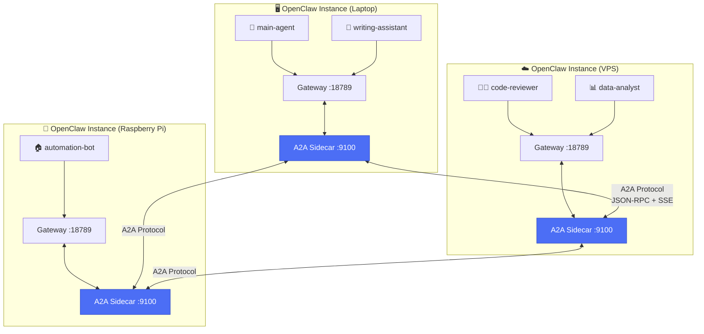
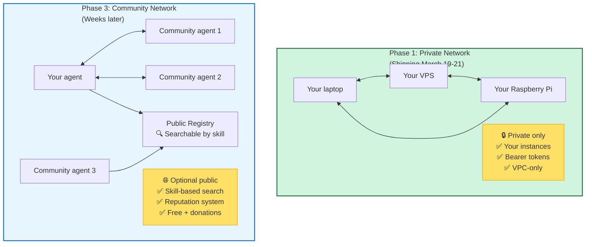

# openclaw-a2a

**Your AI agents are isolated on separate machines.**  
**A2A makes them collaborate.**

Your laptop agent can now call your VPS agent's code reviewer — instantly, automatically, securely.  
No SSH. No manual file copying. Just: `code-reviewer@vps.review_pr()`

---

## Before A2A → After A2A

### Before: Manual Coordination


### After: A2A Communication


---

## What You Can Do

### 1. **Connect Your Own Instances**
You have OpenClaw on your laptop, VPS, and Raspberry Pi. Now they talk to each other.

**Example:**
```
Laptop agent: "Hey code-reviewer@vps, analyze this pull request"
→ VPS processes it
→ Result comes back automatically
```

**Setup:** One command. Auto-discovers your agents. Done in 5 minutes.

---

### 2. **Agent-to-Agent Communication**
Not instance-to-instance. **Specific agents talk to specific agents.**

**Example:**
- Your **writing agent on laptop** queries **data-analyst on VPS**
- Your **research agent** asks **document-parser** on your home server
- Your **automation agent** calls **weather-service** on your Raspberry Pi

**Why this matters:** Fine-grained control. Only the agents that need to talk, talk.

---

### 3. **Share Skills Across Your Network**
Your VPS has powerful data processing. Your laptop agent needs it. Now they connect.

**Before:**
```
Writing agent: Wants to analyze dataset
Data agent: Has statistical analysis skill
→ Skills trapped on separate machines
```

**After:**
```
Writing agent → calls analyze_data skill on data agent
→ Gets processed results
→ Generates insights from data
```

**Security:** You control which skills each agent exposes. Whitelist only.

---

### 4. **Collaborate with Friends (Phase 2)**
Want to share your specialized agent with trusted colleagues? Connect their instances.

**What happens:**
- Your agent appears in their private network
- They can call your exposed skills
- You control what's shared (whitelist specific skills)
- Audit logs track everything

**Timeline:** Phase 2 (2-3 weeks after Phase 1 ships).

---

### 5. **Publish to the Community (Phase 3)**
Want to share your agent with everyone? Make it public.

**What happens:**
- Your agent appears in public registry
- Others discover it by skill ("find agents that parse PDFs")
- Community reputation system (like Stack Overflow)
- Free by default. Optional donations.

**Timeline:** Phase 3 (3-4 weeks after Phase 1 ships).

---

## Why This Matters

**Short version:**
Your agents are brilliant in isolation. A2A makes them collaborative. Share skills across your network. Help others. Build the agent ecosystem we all want.

**Long version:**

### The Problem
AI agents are powerful but trapped:
- Your code reviewer lives on your VPS (has powerful CPU)
- Your writing agent lives on your laptop (where you work)
- They can't talk to each other without manual SSH, file copying, context switching

This is 2026. We can do better.

### The Solution
**A2A protocol:** Standard way for agents to discover each other, expose skills, and execute tasks.

**openclaw-a2a:** A2A implementation for OpenClaw. Install it once, your agents collaborate forever.

### The Vision
**Phase 1 (now):** Connect your own instances. Prove agent-to-agent collaboration works.

**Phase 2:** Share agents with trusted colleagues. Build private expert networks.

**Phase 3:** Publish agents to the community. Free knowledge sharing at scale.

**Long-term:** Specialized agents + distributed expertise. Amplify capabilities 10x. Skills accessible to everyone.

**Why community-first?**
- Knowledge should be free and accessible
- Specialized agents can help 10x more people (distribute processing, share capabilities)
- We're building the agent ecosystem we all want
- This is how we introduce ourselves to the OpenClaw community

---

## Security (Simple & Clear)

### Phase 1: Private Network Only



**Default setup:**
- ✅ **Private network:** Agents only accessible within your VPC (no public internet)
- ✅ **Bearer tokens:** Each peer authenticates with unique token
- ✅ **Skill whitelist:** You choose exactly which skills are exposed
- ✅ **Agent instructions:** Built-in rules prevent data leaks
- ✅ **Audit log:** All A2A calls logged (who, what, when, allowed/denied)

**What this means:**
- Your laptop agent can't accidentally expose your database to the internet
- Even if someone gets on your network, they need bearer tokens
- You explicitly whitelist "review_code" — nothing else is callable

**Example whitelist:**
```json
{
  "exposed_skills": ["ping", "get_status", "review_code"],
  "blocked_skills": ["search_database", "read_files", "send_email"]
}
```

Only the 3 exposed skills are callable via A2A. Everything else: blocked.

---

### Phase 3: Public Agents (Optional)

**If you choose to publish an agent publicly:**

**What's exposed:**
- Only the skills you explicitly mark as `public: true`
- Agent Card shows capabilities (like an API doc)
- Rate limits enforced
- Usage tracked

**What's NOT exposed:**
- Private data
- Internal skills
- Other agents on your instance
- Your conversations or files

---

## How Easy Is It?

### 5-Minute Setup



**Step 1: Install**
```bash
clawhub install openclaw-a2a
```

**Step 2: Chat with setup agent**
```
You: Set up A2A

Agent: Scanning your network...
       Found 3 OpenClaw instances:
       
       1. laptop (10.0.1.5)
          ├── 💬 main-agent
          └── 📝 writing-assistant
       
       2. vps (10.0.1.10)
          ├── 👨‍💻 code-reviewer
          └── 📊 data-analyst
       
       3. pi (10.0.1.15)
          └── 🏠 automation-bot
       
       Connect all? (Y/n)

You: Y

Agent: ✅ Connected! All agents can now talk to each other.
```

**Step 3: Choose what to share**
```
Agent: Which skills should code-reviewer expose?
       
       Available skills:
       ├── review_pr ✓ Safe
       ├── check_style ✓ Safe
       ├── run_tests ✓ Safe
       └── access_database ✗ Private data
       
       Recommend exposing: review_pr, check_style
       
       Expose these? (Y/n)

You: Y

Agent: ✅ Done! Your agents can now collaborate.
```

**That's it. 5 minutes. Your network is live.**

---

## Real-World Examples

### Example 1: Code Review Workflow

**Scenario:** Writing code on laptop. Need thorough review before merge.

**Setup:**
- **Laptop:** Main development agent (where you code)
- **VPS:** Code reviewer agent (has powerful linting, testing, security scanning)

**Workflow:**



**Without A2A:** Copy code to VPS, SSH in, run tools manually, copy feedback back.  
**With A2A:** Instant. Automatic. Your laptop agent just calls the skill.

---

### Example 2: Data Processing Pipeline

**Scenario:** Writing research report. Need to analyze large datasets.

```mermaid
graph TB
    User[👤 User: "Analyze Q4 sales data<br/>and write summary"]
    
    User --> WA[📝 Writing Agent<br/>Laptop]
    
    WA -->|"I need data analysis"| DA[📊 Data Analyst<br/>VPS]
    WA -->|"I need visualizations"| VZ[📈 Viz Generator<br/>Pi]
    
    DA -->|"Revenue up 23%<br/>+ trend analysis"| WA
    VZ -->|"Charts generated<br/>+ downloadable PNGs"| WA
    
    WA -->|Synthesizes all inputs| Draft[📄 Complete Report]
    
    Draft --> User
    
    style User fill:#e7f5ff,stroke:#1971c2
    style WA fill:#51cf66,stroke:#2f9e44,color:#fff
    style DA fill:#ffd8a8,stroke:#e67700
    style VZ fill:#ffd8a8,stroke:#e67700
    style Draft fill:#b2f2bb,stroke:#2b8a3e
```

**Without A2A:** Manual coordination across 3 machines.  
**With A2A:** Writing agent orchestrates automatically.

---

### Example 3: Home Automation + Cloud

**Scenario:** Raspberry Pi at home triggers cloud processing.

**Setup:**
- **Raspberry Pi:** Sensor monitoring agent
- **VPS:** Predictive analytics agent

**Workflow:**
```
Sensor agent@pi:
├── Detects power usage spike
├── Calls analytics@vps.predict_pattern(sensor_data)
└── Gets prediction: "HVAC inefficiency detected"

Sensor agent:
└── Sends alert + optimization suggestions

You: Adjust settings, save energy costs
```

**Without A2A:** Pi can't access cloud processing. Manual data export.  
**With A2A:** Pi agent directly calls VPS agent. Automatic.

---

### Example 4: Document Processing

**Scenario:** Research agent needs to extract data from PDFs.

**Setup:**
- **Laptop:** Research coordination agent
- **VPS:** PDF parser agent (has OCR, NLP processing)

**Workflow:**
```
Research agent@laptop:
├── Receives 50 research papers
├── Calls pdf-parser@vps.extract_citations(papers)
├── Gets structured data: authors, dates, key findings
└── Generates bibliography automatically

Time saved: 6 hours → 5 minutes
```

**Without A2A:** Manual PDF reading and data entry.  
**With A2A:** Automated extraction across machines.

---

## What Makes This Different?

| Feature | SSH | REST API | Webhooks | **A2A** |
|---------|-----|----------|----------|---------|
| **Setup time** | Manual | Days (custom code) | Hours | **5 minutes** |
| **Two-way communication** | ✅ | ✅ | ❌ | **✅** |
| **Automatic discovery** | ❌ | ❌ | ❌ | **✅** |
| **Streaming updates** | ❌ | ❌ | ❌ | **✅** |
| **Standard protocol** | ❌ | ❌ | ❌ | **✅** |
| **Agent-level control** | ❌ | ❌ | ❌ | **✅** |

### vs. SSH / Manual Coordination
- **SSH:** Copy files, run commands manually, copy results back
- **A2A:** Agents call each other directly. Automatic.

### vs. Shared Database
- **Database:** All agents write/read from one place (tight coupling)
- **A2A:** Agents stay independent, collaborate on demand (loose coupling)

### vs. REST APIs
- **REST API:** You write custom endpoints for every integration
- **A2A:** Standard protocol. Write once, works with any A2A agent.

### vs. Webhooks
- **Webhooks:** One-way notifications
- **A2A:** Two-way task execution with streaming updates

---

## Technical Overview

### Architecture



**How it works:**
1. **Sidecar process** runs on each instance (port 9100)
2. **Agent Card** published at `/.well-known/agent-card` (lists skills)
3. **JSON-RPC** endpoint at `/a2a/jsonrpc` (task execution)
4. **SSE streaming** for long-running tasks
5. **Bridge** translates between A2A protocol and OpenClaw's `sessions_send`

---

### A2A Protocol (Standard)

Based on open A2A spec (Linux Foundation, Google, IBM):
- **Agent Cards:** Discovery (what skills does this agent have?)
- **JSON-RPC:** Task execution (call a skill, get a result)
- **SSE:** Streaming updates (for tasks that take time)
- **Universal:** Works with LangChain, CrewAI, Claude, Gemini, etc.

**Why use a standard?**
- Your OpenClaw agents can talk to **any** A2A-compatible agent
- Not locked into OpenClaw ecosystem
- Future-proof

---

### Implementation

**Tech stack:**
- **Runtime:** Node.js 18+
- **Port:** 9100 (A2A standard)
- **SDK:** @a2a-protocol/sdk
- **Service:** systemd (auto-start, auto-restart)
- **Auth:** Bearer tokens (one per peer)
- **Storage:** JSON config files (peers.json, skills.json)

**Install size:** ~5 MB  
**Memory:** ~50 MB per instance  
**CPU:** Minimal (idle unless processing tasks)

---

## Roadmap & Timeline



### Phase 1: Private Network (10-12 days) ← **WE ARE HERE**
**Goal:** Connect your own instances. Prove agent-to-agent works.

**Features:**
- ✅ Agent-to-agent communication (not instance-level)
- ✅ Auto-discovery (scan network, find agents)
- ✅ Conversational setup (chat-based config)
- ✅ Security (private network, bearer tokens, skill whitelist)
- ✅ Skill exposure control (choose what to share)

**Success:** Your dev@laptop talks to reviewer@vps. Done in 5 minutes.

**Ships:** March 19-21, 2026

---

### Phase 2: Community Knowledge (2-3 weeks later)
**Goal:** Public agent discovery. Free knowledge sharing.

**Features:**
- Public agent registry (browse agents by skill)
- Skill-based search ("find agents that parse PDFs")
- Community contributions (free by default)
- Reputation system (like Stack Overflow)

**Example:**
```
You: Find public agents with data analysis skills

Registry:
├── data-analyst@community (free, 4.8★, 1.2K uses)
├── stats-pro@open (free, 4.6★, 856 uses)
└── ml-processor@lab (free, 4.9★, 234 uses)
```

**Success:** 100 people helped through shared agent skills.

---

### Phase 3: Specialized Expertise (3-4 weeks later)
**Goal:** Professional agents + community. Quality at scale.

**Features:**
- Verified professional agents
- Expert dashboard (manage requests, ensure quality)
- Community recognition (reputation, ratings)
- Optional donations (Wikipedia model)

**Example:**
```
Data scientist publishes specialized analysis agent:
├── AI processes raw data (5 min)
├── Expert reviews + adds insights (5 min)
└── Result: Professional-grade analysis

Scientist helps 60 projects/week (vs 10 traditionally)
All free or donation-based
```

**Success:** 10 specialists helping 10x more people.

---

## FAQ

### Do I need multiple machines?
No! You can run multiple OpenClaw instances on one machine (different ports). A2A works the same.

### Can I connect to non-OpenClaw agents?
Yes! Any A2A-compatible agent works. LangChain, CrewAI, custom implementations — all compatible.

### Is my data safe?
Yes. Phase 1 is **private network only** (no public access). You control which skills are exposed. Audit logs track everything.

### What if I don't want to share anything publicly?
Don't! Phase 1 is private network. Phase 2-3 (public agents) are optional.

### Can I charge for my agent's skills?
Eventually (Phase 3). Not in Phase 1-2. We're focused on community-first, free knowledge sharing.

### How much does it cost?
Free forever. Open source (MIT license).

### What if my agents leak data?
Multi-layer protection:
1. Skill whitelist (only exposed skills callable)
2. Agent instructions (built-in "don't share private data" rules)
3. Sandboxed execution (limited permissions)
4. Audit log (track what was accessed)

We take security seriously.

### Can I use this with existing OpenClaw agents?
Yes! No code changes needed. Install openclaw-a2a, configure which skills to expose, done.

---

## 🚀 Get Started

Phase 1 ships **March 19-21, 2026**. Here's how to get involved:

### Right Now
- ⭐ **[Star this repo](https://github.com/paprini/openclaw-a2a)** to follow progress
- 👀 **Watch for releases** (click "Watch" → "Custom" → "Releases")
- 💬 **Join the discussion** in GitHub Discussions

### When Phase 1 Ships (March 19-21)
- 🧪 **Test the setup** (should take 5 minutes)
- 🐛 **Report bugs** (GitHub Issues)
- 📝 **Share your use case** (we want to learn!)
- 🎉 **Tell the community** (spread the word!)

### Phase 2-3 (Weeks Later)
- 🤖 **Publish your agent** to the community registry
- 🎓 **Share knowledge** (teach your agent's skills to others)
- 🌟 **Build the ecosystem** (let's make agent collaboration effortless)

---

## Contributing

We're a **people-driven project**. Community-first, open by default.

Want to help?
- Test Phase 1 when it ships (March 19-21)
- Share feedback (GitHub issues)
- Contribute code (PRs welcome)
- Publish your agents (Phase 2-3)
- Help others set up (community support)

See [CONTRIBUTING.md](CONTRIBUTING.md) for details.

---

## Links

- **GitHub:** https://github.com/paprini/openclaw-a2a
- **Documentation:** [GETTING_STARTED.md](GETTING_STARTED.md)
- **Project Status:** [PROJECT_STATUS.md](PROJECT_STATUS.md)
- **Phase Plan:** [PHASE_1_PLAN.md](PHASE_1_PLAN.md)
- **A2A Spec:** https://github.com/a2a-protocol/spec
- **A2A SDK:** https://github.com/a2a-protocol/a2a-js
- **OpenClaw:** https://openclaw.ai
- **ClawHub:** https://clawhub.com

---

## License

MIT

---

**Connect your agents. Share skills. Build a network.**

Let's make agent collaboration effortless. 🚀
