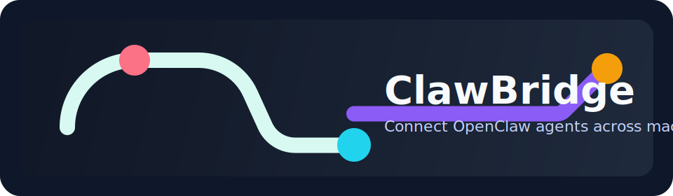
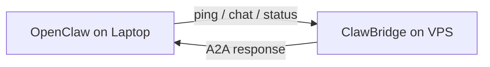
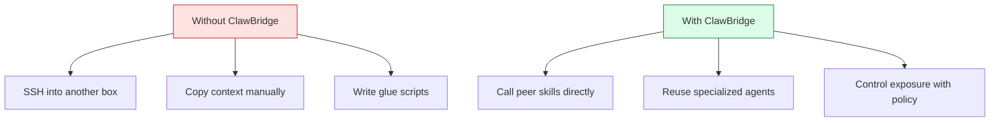

# ClawBridge

ClawBridge lets OpenClaw agents on different machines talk to each other.

You can use it in two ways:
- Simple mode: connect two or more machines and let agents ping, check status, and exchange messages.
- Advanced mode: run it as an operator-managed A2A service with permissions, TLS, and optional OpenClaw gateway bridging.

## Pick Your Path

### I want the easiest setup

Start here: [docs/QUICKSTART_SIMPLE.md](docs/QUICKSTART_SIMPLE.md)

This path is for people who want a working connection between machines with the fewest decisions.

### I want to run it publicly or in production

Start here: [docs/OPERATOR_GUIDE.md](docs/OPERATOR_GUIDE.md)

This path is for operators managing domains, TLS, permissions, deploys, and incident recovery.

### I want bridge/API details

Start here:
- [docs/BRIDGE_SETUP.md](docs/BRIDGE_SETUP.md)
- [docs/API_REFERENCE.md](docs/API_REFERENCE.md)

### I am an AI agent installing this repo for a user

Start here: [docs/AGENT_INSTALL.md](docs/AGENT_INSTALL.md)

## What Success Looks Like

Two machines running OpenClaw can expose selected skills to each other over A2A.



For most users, the first milestone is simple:

1. Install ClawBridge on machine A.
2. Install ClawBridge on machine B.
3. Run setup on both.
4. Start both servers.
5. Run `npm run ping`.

If that works, you have a real multi-machine agent link.

## Why It Matters



## Core Capabilities

- `ping`: check peer connectivity
- `get_status`: inspect a peer's available skills and uptime
- `chat`: send a message through the peer's local OpenClaw gateway
- `broadcast`: fan a message out to multiple peers
- `openclaw_*`: optionally expose a tightly controlled subset of OpenClaw gateway tools

## Quick Install

```bash
git clone https://github.com/paprini/clawbridge.git
cd clawbridge
npm install
npm run setup
npm run verify
npm start
```

If you are not sure what to do next, go to [docs/QUICKSTART_SIMPLE.md](docs/QUICKSTART_SIMPLE.md).

## Versioning

ClawBridge now uses `package.json` as the single source of truth for the installed software version.

Users can see the installed version in:
- `npm run status`
- `node src/cli.js version`
- `GET /status`
- `GET /health`
- `get_status`
- the A2A agent card

Release flow:

```bash
npm version patch
git push origin main --follow-tags
```

Install a specific release tag:

```bash
git clone --branch v0.1.1 --depth 1 https://github.com/paprini/clawbridge.git
```

Use:
- `patch` for fixes
- `minor` for backward-compatible features
- `major` for breaking changes

See [CHANGELOG.md](CHANGELOG.md) for release notes.

## Documentation

- [docs/README.md](docs/README.md): documentation map by audience
- [docs/QUICKSTART_SIMPLE.md](docs/QUICKSTART_SIMPLE.md): shortest human path to first success
- [docs/USER_GUIDE.md](docs/USER_GUIDE.md): concept + usage guide for normal users
- [docs/SETUP.md](docs/SETUP.md): setup tool reference
- [docs/OPERATOR_GUIDE.md](docs/OPERATOR_GUIDE.md): deploy and operations path
- [docs/PUBLIC_QUICKSTART.md](docs/PUBLIC_QUICKSTART.md): fastest public HTTPS deployment
- [docs/BRIDGE_SETUP.md](docs/BRIDGE_SETUP.md): advanced bridge configuration
- [docs/API_REFERENCE.md](docs/API_REFERENCE.md): endpoints, payloads, config schema
- [docs/DIAGRAMS.md](docs/DIAGRAMS.md): reusable marketing and architecture diagrams

## Product Positioning

ClawBridge should feel simple at first use and rigorous in advanced operation.

That means:
- simple users should see a short, linear path
- advanced users should get exact controls and protocol detail
- those two styles should stay separated
