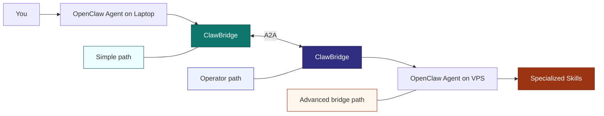
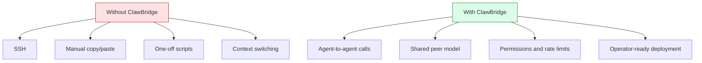
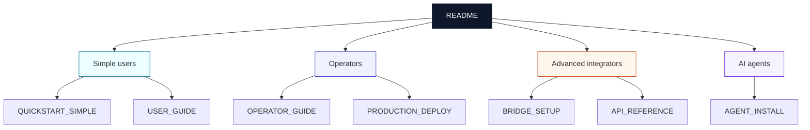

# Diagrams

**Audience:** community-facing marketing, docs authors, and advanced explainers

These diagrams are intentionally separated from setup docs so beginner flows stay short.

## Community Overview

Use this when explaining the product at a high level:

## Benefit Diagram

Use this when positioning the value of ClawBridge to the community:

## Audience Model

This is the docs structure the repo now follows:

