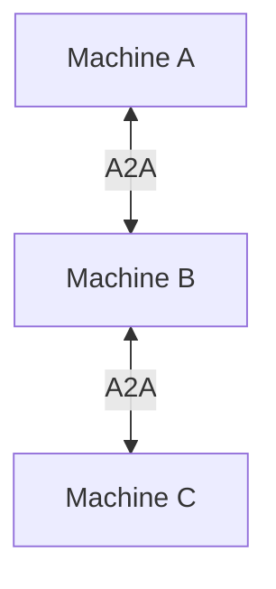

# User Guide

**Audience:** normal human users who want to understand and use ClawBridge without diving into operator internals.

## What ClawBridge Is

ClawBridge connects OpenClaw instances across machines.

Without it, an agent on one machine usually needs manual glue to use tools or skills on another machine.

With it, agents can call each other through A2A in a controlled way.

## The Basic Mental Model

Each machine runs:
- OpenClaw
- ClawBridge
- a small set of exposed skills

Each machine can also know about peer machines in `config/peers.json`.

## First Goal

Do not start with advanced features.

Your first goal should be:
- install on two machines
- connect them
- verify `ping`

Use [QUICKSTART_SIMPLE.md](QUICKSTART_SIMPLE.md) for that first success path.

## What Skills Matter First

- `ping`: proves the connection works
- `get_status`: shows what a peer exposes

After that:
- `chat`: useful when the peer can deliver messages through its local OpenClaw gateway
- `broadcast`: useful when you have several peers

## Files You Will See

- `config/agent.json`: identity and URL of this machine
- `config/peers.json`: known peer machines
- `config/skills.json`: which skills this machine exposes
- `config/bridge.json`: optional advanced bridge feature

## Typical Growth Path

### Stage 1: Two-machine private setup

Use [QUICKSTART_SIMPLE.md](QUICKSTART_SIMPLE.md)

### Stage 2: Multi-peer coordination

Once `ping` works, add more peers and start using `get_status`, `chat`, and `broadcast`.

### Stage 3: Public or production deployment

Move to [OPERATOR_GUIDE.md](OPERATOR_GUIDE.md)

### Stage 4: Advanced bridge features

Move to [BRIDGE_SETUP.md](BRIDGE_SETUP.md)

## What Not To Worry About At First

You do not need these on day one:
- raw JSON-RPC payloads
- public HTTPS deployment
- gateway tool whitelisting
- token rotation policy
- production rollback flow

Those are real topics, but they belong to the operator path, not the beginner path.

## When To Switch To Operator Docs

Switch from user docs to operator docs when:
- you want a public domain
- you need HTTPS
- you want systemd or Docker supervision
- you need permissions and rate limits tuned for real traffic
- you are responsible for uptime

Then use [OPERATOR_GUIDE.md](OPERATOR_GUIDE.md).
